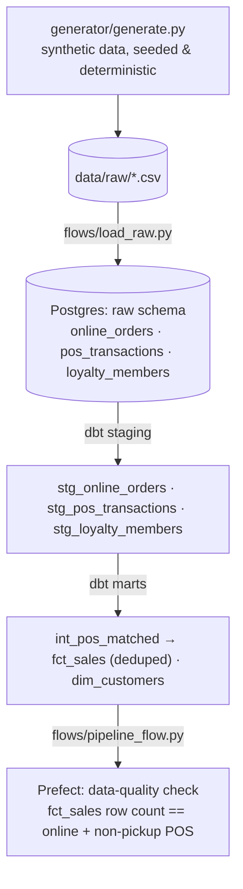

# retail-data-pipeline

[](https://www.python.org)
[](https://www.getdbt.com)
[](https://www.prefect.io)
[](https://www.postgresql.org)
[](https://docs.docker.com/compose/)
[](./LICENSE)

A small, self-contained data pipeline that consolidates three messy synthetic
"source systems" — online orders, POS transactions, and loyalty members —
into one clean, deduplicated sales mart. **Prefect** orchestrates it, **dbt**
transforms it, **Postgres** stores it.

All data is synthetic and generated locally. No client data, no proprietary
logic — this demonstrates the same multi-source consolidation pattern used in
production data warehouse work, safe to clone, run, and read end to end.

## The problem it solves

Real retailers often run online orders and in-store POS as separate systems.
When a customer orders online for in-store pickup, the sale can get recorded
**twice** — once when the order is placed, once again when the store scans it
at pickup. Left alone, that inflates revenue and unit counts in every report
downstream.

This pipeline generates that exact scenario (a configurable ~5-10% of online
orders are mirrored into the POS feed under a different ID) and then
reconciles it in dbt, so the final `fct_sales` mart has exactly one row per
real sale — no matter which system saw it first.

**A real pair from a generated run**, both describing the same physical
sale:

| Source | ID | Customer | SKU | Qty | Price | Timestamp |
|---|---|---|---|---|---|---|
| Online order | `WEB-000004` | mitchellclark@example.com | SKU-0015 | 1 | $99.23 | 2026-03-22 12:17 (fulfillment: **pickup**) |
| POS scan at pickup | `POS-000001` | mitchellclark@example.com | SKU-0015 | 1 | $99.23 | 2026-03-24 01:17 |

`int_pos_matched` identifies this pair via a **mutual nearest-match** join
(matching customer/SKU/quantity/price within a 2-day window, ranked from both
sides so each side pairs with at most one match — this guards against two
unrelated coincidental sales of the same item wrongly cancelling each other
out) and drops the POS row from `fct_sales`, keeping the online order as the
single source of truth for this sale.

## What this demonstrates

- **Multi-source consolidation** — reconciling systems that disagree on IDs, column names, and formats into one analytics-ready mart
- **Non-trivial deduplication logic** — a mutual nearest-match join, not a naive `DISTINCT`, with a dbt unit test asserting it on hand-built fixtures (including the coincidental-collision edge case)
- **ELT with dbt** — layered staging → marts, schema tests, and unit tests, not just a pile of one-off SQL
- **Pipeline orchestration with Prefect** — generate → load → transform → data-quality check as one flow
- **TDD throughout** — every Python module was written test-first (generator, loader, flow tasks)

## Architecture



## Running it

Requires [uv](https://docs.astral.sh/uv/) and Docker.

```bash
git clone https://github.com/rriaz6601/retail-data-pipeline
cd retail-data-pipeline
uv sync
docker compose up -d --wait postgres
uv run python -m flows.pipeline_flow
```

This generates ~1000 online orders + ~580 POS transactions + 150 loyalty
members, loads them into Postgres, builds every dbt model, runs all dbt
tests, and checks that `fct_sales` has exactly one row per real sale.

Note: dbt's schema-generation concatenates the profile's base schema (`dbt`)
with each model's `+schema` config, so the mart doesn't land at
`marts.fct_sales` — it lands at `dbt_marts.fct_sales`. Query it directly once
the pipeline has run:

```sql
select sale_id, customer_email, sku, quantity, unit_price, sale_amount, source_channel
from dbt_marts.fct_sales
order by sale_ts
limit 5;
```

```
  sale_id   |       customer_email       |   sku    | quantity | unit_price | sale_amount | source_channel
------------+----------------------------+----------+----------+------------+-------------+----------------
 POS-000466 | perrymark@example.com      | SKU-0011 |        3 |      36.70 |      110.10 | pos
 POS-000216 | william40@example.org      | SKU-0002 |        4 |       8.63 |       34.52 | pos
 WEB-000142 | donnacampbell@example.net  | SKU-0022 |        3 |     106.23 |      318.69 | online
 WEB-000658 | camposmichelle@example.org | SKU-0049 |        2 |      97.17 |      194.34 | online
 WEB-000029 | lynchgeorge@example.net    | SKU-0011 |        4 |      36.70 |      146.80 | online
```

A default run generates 1000 online orders + 583 POS transactions, with 83 of
those POS rows identified as pickup duplicates — leaving `fct_sales` at
exactly 1000 + (583 − 83) = **1500** rows, verified by the flow's own
data-quality check on every run.

## Testing

| Layer | What it covers | Command |
|---|---|---|
| Unit (Python) | Generator determinism (byte-identical CSVs across runs with the same seed), overlap-rate math, the flow's data-quality check logic | `uv run pytest` |
| Integration (Python + Postgres) | Loader writes the right row counts into an isolated `raw_test` schema | `uv run pytest tests/test_load_raw.py` |
| Schema (dbt) | Not-null/unique/relationship constraints across staging and marts | `cd dbt && DBT_PROFILES_DIR=./profiles uv run dbt test` |
| Unit (dbt) | `int_pos_matched`'s dedup logic against hand-built fixtures — a genuine pickup match, a coincidental non-pickup collision, and a no-match case | same `dbt test` command (unit tests run alongside schema tests) |

## Why this exists

This is one of a few small portfolio projects, each demonstrating a specific
data engineering pattern with fully synthetic data — no client work, safe to
read and run end to end.
